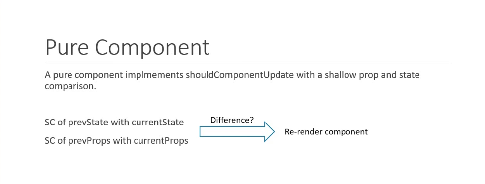

# Pure Components   

There is a another way to create class component without 'React.Component'.

Regular Component.   
* A regular component does not implement the shouldComponentUpdate method. It always returns true by default.   


Pure Component.   
* A pure component on the other hand implements 'shuldComponentUpdate' with a shallow props and state comporison.   



1. create class component call 'ParentComp' in component folder and make two children call 'PureComp' and 'RegComp' and put console.log for render function for both child. 
* in 'Parent' component push state change function with timer.   

ParentComp.js
```js
import React, { Component } from 'react';
import RegComp from './RegComp';
import PureComp from './PureComp';

class ParentComp extends Component {
    constructor(props) {
      super(props)
    
      this.state = {
         name: 'Samadhi'
      }
      this.timer = null;
    }
    componentDidMount(){
        this.timer = setInterval(()=>{
          this.setState({name:'Laksahan'})
        }, 2000)
    }
    componentWillUnmount(){
      clearInterval(this.timer);
    }
  render() {
    console.log("************ parent component render ******************");
    return (
      <div>
        <RegComp name={this.state.name}/>
        <PureComp name={this.state.name}/>
      </div>
    )
  }
}

export default ParentComp;
```

RegComp.js 
```js
import React, { Component } from 'react';

class RegComp extends Component {

  render() {
    console.log("************ regComp component render ******************");
    return (
      <div>Regular Component {this.props.name}</div>
    )
  }
}

export default RegComp;
```

PureComp.js 
```js
import React, { PureComponent } from 'react';

class PureComp extends PureComponent {
  render() {
    console.log("************ pureComp component render ******************");
    return (
      <div>Pure Component {this.props.name}</div>
    )
  }
}

export default PureComp;
```

2. In the console area show only Regular component update render method and Pure component not.

3. show how to use memo as higher order function to achieve same behaviour as Pure Component.  
 * create new functional component call 'MemoComp' as child compoent of 'ParentComp'.    

MemoComp.js
```js  
import React from 'react';

const MemoComp = ({name}) => {
  console.log("************ memo component render ******************");
  return (
    <div>{name}</div>
  )
}

export default React.memo(MemoComp);
// export default MemoComp;
```

